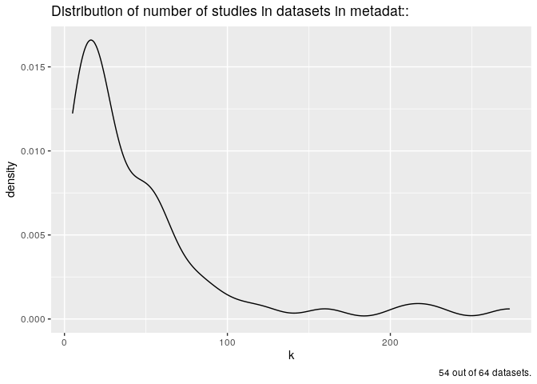
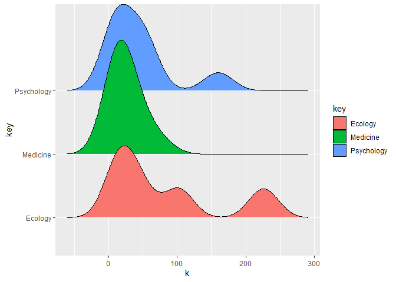

<!-- README.md is generated from README.Rmd. Please edit that file -->

``` r
# load packages
library(metadat)
library(tidyverse)
library(metadatanalysis)
```

Questions to answer about the data contained in `metadat::`

1.  What is the distribution of sample sizes n, for each study?
2.  What is the distribution of minimum n and maximum n sample sizes?
3.  What is the distribution of k, number of studies?

## distribution of k

``` r
md <- get_metadata()

# distribution of k, number of studies
plotdat <- md %>% 
  dplyr::filter(class != "phylo") %>% 
  mutate(k = map(raw_dat, get_k), 
         row_n = map_int(raw_dat, nrow)) %>% 
  dplyr::filter(k != "no study id") %>% 
  mutate(k = as.integer(k))  

# plot k
  plotdat %>% 
    ggplot(aes(x = k)) +
  geom_density() +
  labs(title =  
  stringr::str_wrap("Distribution of number of studies in datasets in 
       metadat::", 80),
       caption = paste(nrow(plotdat), "out of", nrow(md), "datasets."))
```



``` r
Rd<-readRDS(paste0(.libPaths()[1],"/metadat/Meta/Rd.rds"))# How do I make this generic rather than just based on my .libPaths?

Ridgeplotdat<-Rd %>%
  select(c(Name,Title, Concepts)) %>%
  mutate(Medicine= str_detect(Concepts, "medicine")) %>%
  mutate(Education= str_detect(Concepts, "eductaion")) %>%
  mutate(Psychology= str_detect(Concepts, "psychology")) %>%
  mutate(Infants= str_detect(Concepts, "infants")) %>%
  mutate(Oncology= str_detect(Concepts, "oncology")) %>%
  mutate(Dentistry= str_detect(Concepts, "densitry")) %>%
  mutate(Ecology= str_detect(Concepts, "ecology")) %>%
  mutate(Evolution= str_detect(Concepts, "evolution")) %>%
  mutate(Psychiatry= str_detect(Concepts, "psychiatry")) %>%
  mutate(Phylogeny= str_detect(Concepts, "phylogeny")) %>%
  mutate(Sociology= str_detect(Concepts, "sociology")) %>%
  mutate(Plant= str_detect(Concepts, "plant")) %>%
  mutate(Cardiology= str_detect(Concepts, "cardiology")) %>%
  dplyr::select(-Title, -Concepts) %>%
  gather(key=key, value=value, -Name) %>%
  filter(value==TRUE) %>%
  mutate(pkg_name=Name) %>%
  add_count(key)
#> Warning in stri_detect_regex(string, pattern, negate = negate, opts_regex =
#> opts(pattern)): argument is not an atomic vector; coercing

#> Warning in stri_detect_regex(string, pattern, negate = negate, opts_regex =
#> opts(pattern)): argument is not an atomic vector; coercing

#> Warning in stri_detect_regex(string, pattern, negate = negate, opts_regex =
#> opts(pattern)): argument is not an atomic vector; coercing

#> Warning in stri_detect_regex(string, pattern, negate = negate, opts_regex =
#> opts(pattern)): argument is not an atomic vector; coercing

#> Warning in stri_detect_regex(string, pattern, negate = negate, opts_regex =
#> opts(pattern)): argument is not an atomic vector; coercing

#> Warning in stri_detect_regex(string, pattern, negate = negate, opts_regex =
#> opts(pattern)): argument is not an atomic vector; coercing

#> Warning in stri_detect_regex(string, pattern, negate = negate, opts_regex =
#> opts(pattern)): argument is not an atomic vector; coercing

#> Warning in stri_detect_regex(string, pattern, negate = negate, opts_regex =
#> opts(pattern)): argument is not an atomic vector; coercing

#> Warning in stri_detect_regex(string, pattern, negate = negate, opts_regex =
#> opts(pattern)): argument is not an atomic vector; coercing

#> Warning in stri_detect_regex(string, pattern, negate = negate, opts_regex =
#> opts(pattern)): argument is not an atomic vector; coercing

#> Warning in stri_detect_regex(string, pattern, negate = negate, opts_regex =
#> opts(pattern)): argument is not an atomic vector; coercing

#> Warning in stri_detect_regex(string, pattern, negate = negate, opts_regex =
#> opts(pattern)): argument is not an atomic vector; coercing

#> Warning in stri_detect_regex(string, pattern, negate = negate, opts_regex =
#> opts(pattern)): argument is not an atomic vector; coercing

Ridgeplotdat1<-inner_join(Ridgeplotdat,plotdat)
#> Joining, by = "pkg_name"

library(ggridges)
Ridgeplotdat1 %>%
  filter(n>5) %>%
  ggplot(aes(x = k, y = key, fill=key)) + geom_density_ridges()
#> Picking joint bandwidth of 21.6
```


