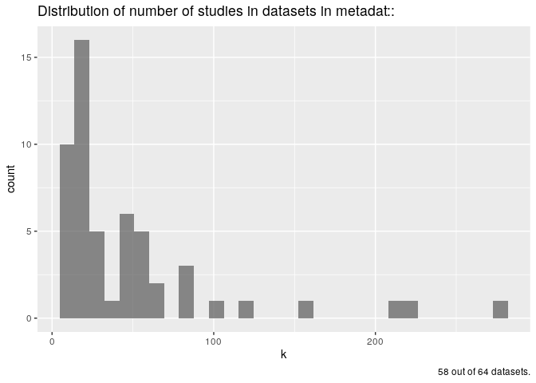

<!-- README.md is generated from README.Rmd. Please edit that file -->

``` r
# load packages
library(metadat)
library(tidyverse)
library(metadatanalysis)
```

Questions to answer about the data contained in `metadat::`

1.  What is the distribution of sample sizes n, for each study?
2.  What is the distribution of minimum n and maximum n sample sizes?
3.  What is the distribution of k, number of studies?

## distribution of k

``` r
md <- get_metadata()

# distribution of k, number of studies
plotdat <- md %>% 
  dplyr::filter(class != "phylo") %>% 
  mutate(k = map(raw_dat, get_k), 
         row_n = map_int(raw_dat, nrow)) %>% 
  dplyr::filter(k != "no study id") %>% 
  mutate(k = as.integer(k))  
#> Warning in mask$eval_all_mutate(dots[[i]]): NAs introduced by coercion

#> Warning in mask$eval_all_mutate(dots[[i]]): NAs introduced by coercion

#> Warning in mask$eval_all_mutate(dots[[i]]): NAs introduced by coercion

#> Warning in mask$eval_all_mutate(dots[[i]]): NAs introduced by coercion

# plot k
  plotdat %>% 
    ggplot(aes(x = k)) +
  geom_histogram(alpha = 0.7) +
  labs(title =  
  stringr::str_wrap("Distribution of number of studies in datasets in 
       metadat::", 80),
       caption = paste(nrow(plotdat), "out of", nrow(md), "datasets."))
#> `stat_bin()` using `bins = 30`. Pick better value with `binwidth`.
#> Warning: Removed 4 rows containing non-finite values (stat_bin).
```



``` r


Ridgeplotdat1<-inner_join(meta_of_dat,plotdat)

library(ggridges)
Ridgeplotdat1 %>%
  filter(n>5) %>%
  ggplot(aes(x = k, y = key, fill=key)) + geom_density_ridges()+
  labs(title =  
  stringr::str_wrap("Distribution of number of studies per major discipline in
       metadat::", 40),
       caption = paste(nrow(Ridgeplotdat1 %>%
  filter(n>5)), "out of", nrow(md), "datasets."), y="Major discipline")+
  ggthemes::theme_base()
```


# sample sizes

``` r

hybrid_n <- 
  md %>% 
  mutate(sample_size = map(raw_dat, get_n)) %>% 
  select(dat_name,sample_size) %>% 
  mutate(class = map_chr(sample_size, class)) %>% 
  dplyr::filter(class == "numeric") %>% 
  select(-class) 

long_n <-
  hybrid_n %>% 
  unnest(cols = c(sample_size))


# why does this not plot? need to investigate further

long_n %>%
  ggplot(aes(x = log(sample_size), y = dat_name)) +
  geom_density_ridges(
    colour = "grey",
    fill = "grey",
    alpha = 0.4
  ) +
  labs(
    title = "Distributions of sample sizes in metadat:: datasets",
    y = "metadat:: dataset",
    x = "log(sample size)",
    caption = paste0(nrow(hybrid_n), " out of ", nrow(md), " datasets in the metadat:: package.")
  )
#> Picking joint bandwidth of 0.343
#> Warning: Removed 12 rows containing non-finite values (stat_density_ridges).
```


